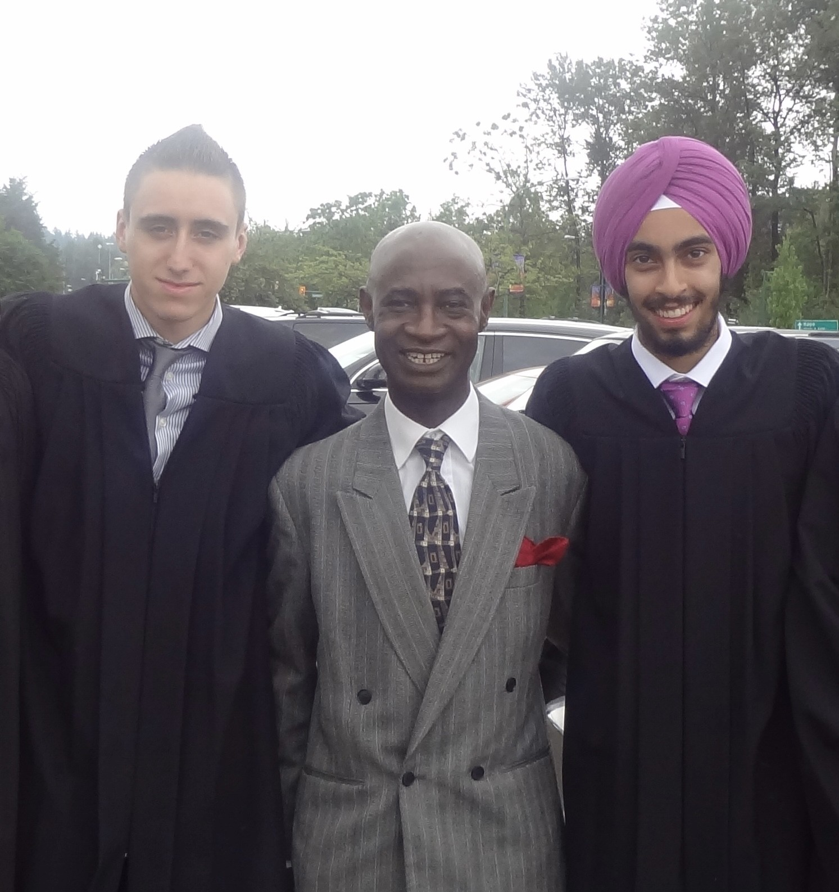
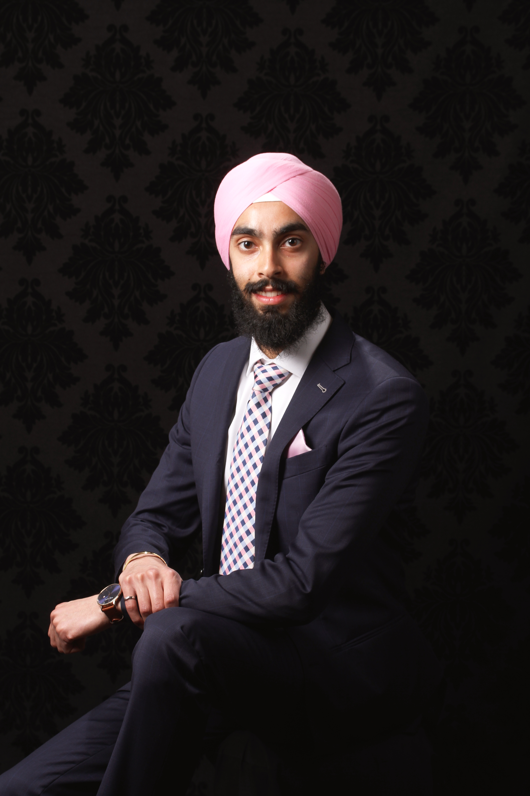

# Mentors

  
  

    <h3 class="title">Amarjit Singh Kambo (ਅਮਰਜੀਤ ਸਿੰਘ ਕੰਬੋ)</h3>
  

My paternal grandfather, Amarjit Singh, was a highly skilled machinist in India, and moved to Canada in the 1990's, where he began working at a furniture shop making custom wooden furniture. His touch can be seen all throughout our house, including the bed frames he made for us, and the various picture frames and mirrors he hung up. Whenever there was something that needed to be fixed or made, my grandfather was the person to come up with a simple solution.

One of the reasons I decided to become an engineer, was so that I could be more like him! He often made it a point to ask about my career and educational goals, and was always very fond of my choice to become an engineer.

  
  

    <h3 class="title">Ibrahim Adamu</h3>
  

Mr Adamu was my Electronics teacher while I attended Burnaby Central Secondary school. I remember how excited I was to be in his class, tinkering with all kinds of electronics projects. One of the most memorable things from his class was a project he did every year, the "Tingler". It was a scaled down version of a "Buzz Wire" arcade game that involves guiding a loop through a bending wire. Mr Adamu's version of this project had a step-up transformer and some metalic contacts which would zap the user if they contacted the loop and the wire.

Mr Adamu was one of the first mentors I had that encouraged me to explore electronics and engineering further at the undergraduate level.

  
  

    <h3 class="title">Azim Ebrahimzadeh</h3>
  

Azim was my neighbour for the first 22 years of my life. An engineer by trade, he was always very proud of my choice to study engineering at BCIT, as he too had completed his degree in engineering there. Working at BC Hydro, Azims career in engineering was anything but typical! He had studied engineering in Iran before leaving and eventually ending up in Canada. As his credentials didn't transfer, Azim worked in the mail room at BC Hydro while attending night school. After count-less hours of studying on top of working a full-time job and caring for his family, he eventually earned his credentials and his Professional Engineering license with EGBC. He often told me about his work as an engineer at the BC Hydro Burnaby Office, and always spoke highly of the profession.

Azim's encouragement and praises made me want to become and engineer!