# Projects

## 2019

    

        <h3 class="project-title">
            <a href="#" class="project-link" data-gallery="autonomous-vineyard">
                Autonomous Vineyard Harvesting
            </a>
        </h3>
        
Our senior engineering capstone group aimed to improve on current grape picking systems by developing a robotic vehicle that can harvest grape crops autonomously and selectively. It was required to navigate a vineyard without the need for human intervention, work during all times of the day, and successfully detect and harvest wine grape crops using cutting-edge vision technologies, robotics, and various engineering methods we’ve acquired at BCIT. We were able to create and demonstrate the proof-of-concept autonomous vehicle utilizing a robotic arm and custom cutting end-effector. Read our capstone proposal and final report for more information

        
T Calderbank, B Aimar, N Kambo

        
2019

        

            Robotics, Machine Vision
            <a href="https://github.com/terrycalderbank/vinebot_ml" class="tag tag-arxiv">GITHUB</a>
            <a href="https://github.com/terrycalderbank/soe-vinebot" class="tag tag-github">GITHUB</a>
        

    

## 2018

    <!-- 

        
    
 -->
    

        <h3 class="project-title">
            <a href="#" class="project-link" data-gallery="automated-writing">
                Automated Writing Utensil
            </a>
        </h3>
        
For my embedded systems term project, I designed and implemented a simple P-D controller for two Quanser SRV02 motors using a real-time embedded system (TMS320F28027). Parts were fabricated (PLA printing) to allow a pen to draw anywhere within a 36in2 square. This project involved interfacing the RTES to external hardware including power amplifiers and quadrature encoders, through the use of various communications standards (SPI & SCI for example).

        
N Kambo

        
2018

        

            C/C++
            RTOS
            <!-- <a href="https://arxiv.org/abs/2502.00757" class="tag tag-arxiv">ARXIV</a>
            <a href="https://github.com/J-Rosser-UK/AgentBreeder" class="tag tag-github">GITHUB</a> -->
        

    

    <!-- 

        
    
 -->
    

        <h3 class="project-title">
            <a href="#" class="project-link" data-gallery="heat-exchanger">
                Heat Exchanger Modeling and Controller Design
            </a>
        </h3>
        
As part of the Industrial Control Systems course at BCIT, I was tasked with designing a temperature-flow cascade control strategy to regulate the outlet water temperature of a gas-liquid heat exchanger, incorporating disturbances such as steam header pressure, inlet water temperature, and water flow-rate. After a series of bump tests, I created models of the heat exchanger and controller using the Emerson DeltaV software suite, and a simulation of a DeltaV DCS and HMI. My control strategy was tested both in the simulation and on the process.

        
N Kambo

        
2018

        

            Industrial Control Systems
            DCS
            P&ID
        

    

    <!-- 

        
    
 -->
    

        <h3 class="project-title">
            <a href="#" class="project-link" data-gallery="audio-processor">
                DE1-SoC Hardware Audio
            </a>
        </h3>
        
My partner and I in a group of two were able to synthesize and test hardware in verilog to configure the Wolfson WM8731 audio codec and an ISSI 64MB SDRAM chip so that we could play audio between a line-in and line-out port on the Terasic DE1-SoC FPGA development board. We were also able to implement a delayed audio effect where a previous sample would be scaled and added to the current sample. Finally, we were able to create a PCB for the Wolfson WM8731 audio codec since some of the Terasic development boards such as the DE0-Nano or even the DE10-Nano don't include an audio codec on-board. I've posted this project on GitHub, with the hope that others can use my work as a starting point for their own audio-related projects.

        
B Pham, N Kambo

        
2018

        

            System Verilog
            PCBA
            Digital Design
            <!-- <a href="https://arxiv.org/abs/2502.00757" class="tag tag-arxiv">ARXIV</a> -->
            <a href="https://github.com/navrajkambo/De1-SoC-Verilog-Audio-HW-FX" class="tag tag-github">GITHUB</a>
        

    

## 2017

    <!-- 

        
    
 -->
    

        <h3 class="project-title">
            <a href="#" class="project-link" data-gallery="maze-car">
                Self Driving Maze Navigation Car
            </a>
        </h3>
        
In a group of 2, my partner and I were able to design and implement a self driving car that was able to solve a maze. The maze included colored markers to indicate turning directions, requiring the useof computer vision. The brain of our vehicle was the Raspberry Pi 3 Model B+, running the Raspbian OS, with software written in C++ to navigate the vehicle as well as send a video stream over sockets to a client application. A custom PCB was created using Altium Designer and assembled to hold components needed for the vehicle.

        
A Dhillon, N Kambo

        
2017

        

            C++
            Machine Vision
            <!-- <a href="https://arxiv.org/abs/2502.00757" class="tag tag-arxiv">ARXIV</a>
            <a href="https://github.com/J-Rosser-UK/AgentBreeder" class="tag tag-github">GITHUB</a> -->
        

    

    
    
    
    
    <iframe width="580" height="320" frameborder="0" allowfullscreen="" webkitallowfullscreen="" mozallowfullscreen="" src="https://gallery.autodesk.com/projects/141623/assets/482261/embed"></iframe>
    <iframe width="560" height="315" src="https://www.youtube.com/embed/ssWetc3PHkY" frameborder="0" allow="accelerometer; autoplay; encrypted-media; gyroscope; picture-in-picture" allowfullscreen=""></iframe>

    
    
    
    
    
    
    
    
    
    
    
    <iframe width="580" height="320" frameborder="0" allowfullscreen="" webkitallowfullscreen="" mozallowfullscreen="" src="https://gallery.autodesk.com/projects/141620/assets/482246/embed"></iframe>

    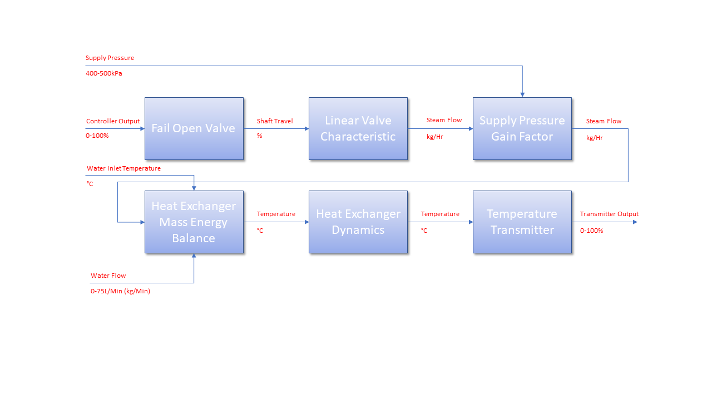
    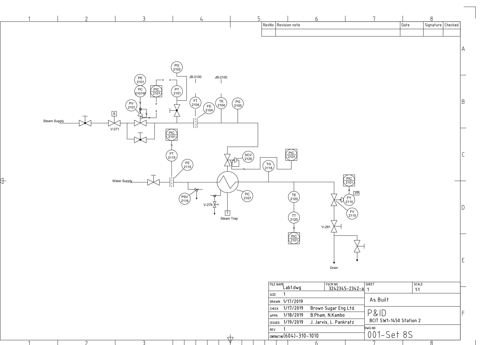
    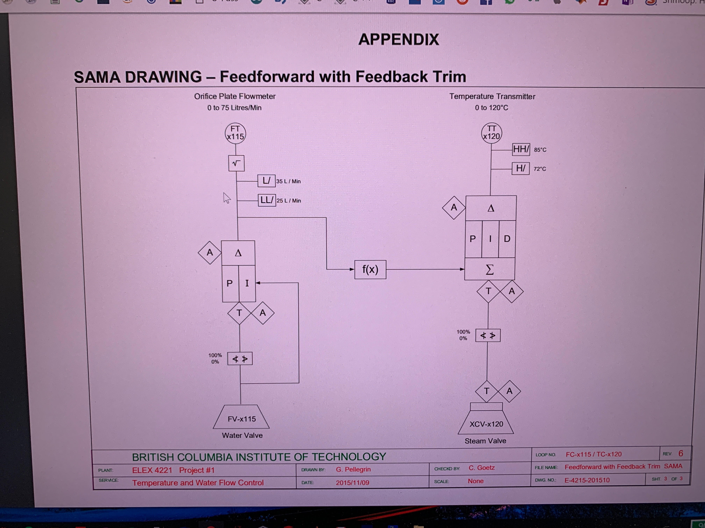
    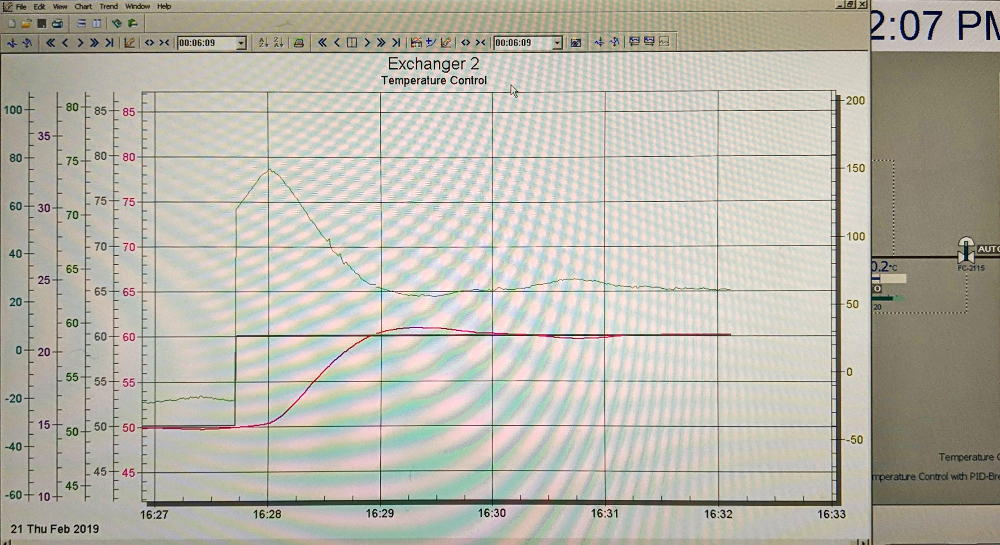
    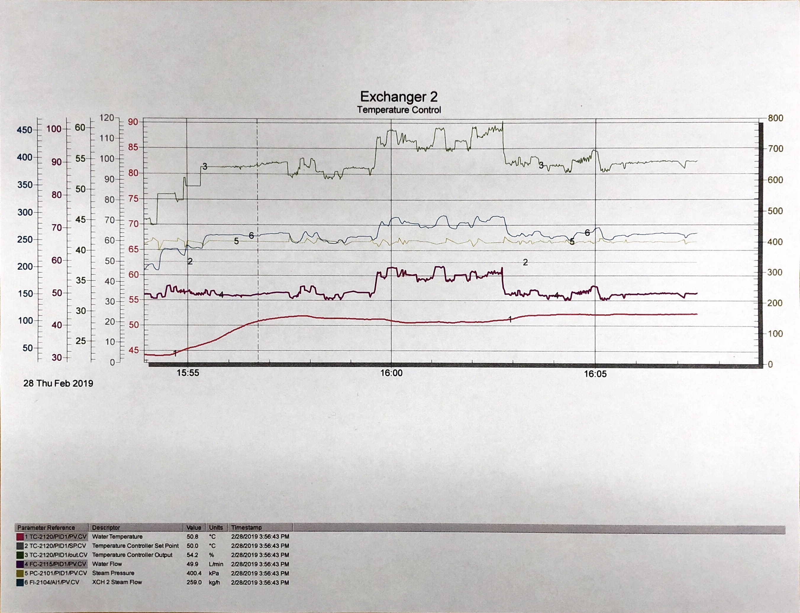
    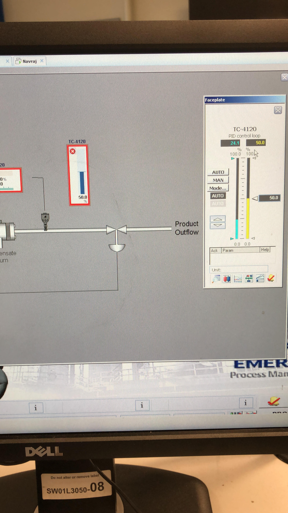

    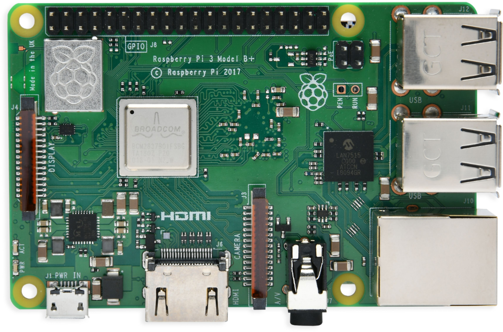
    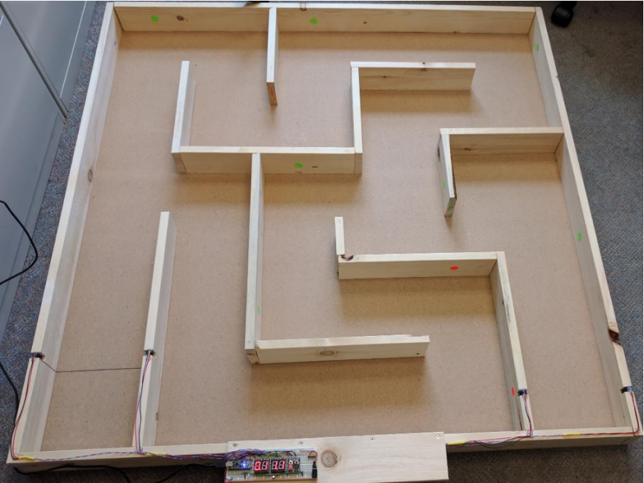
    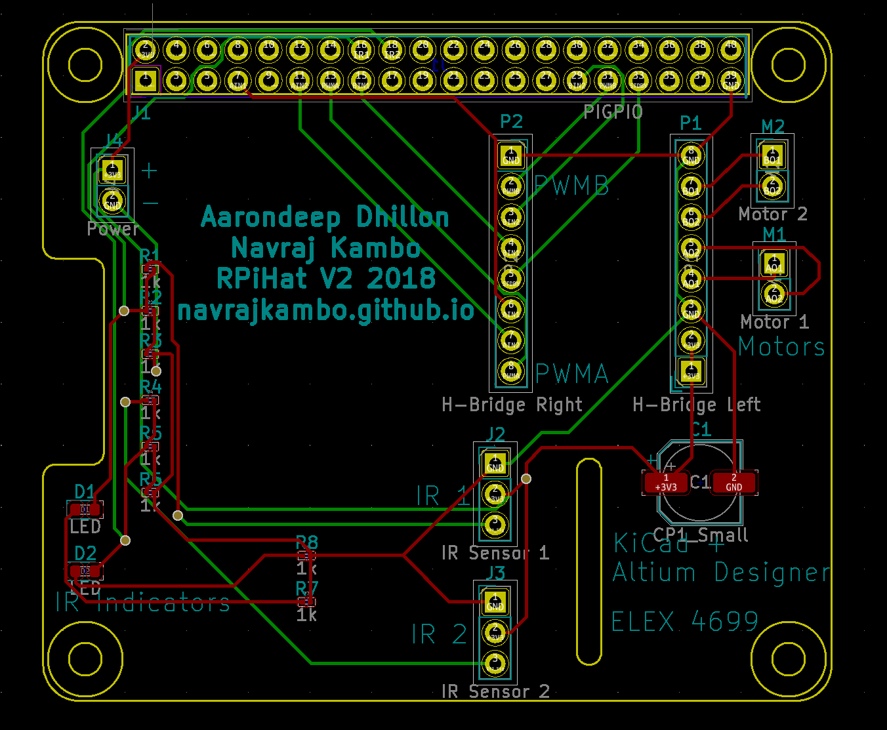
    <iframe width="580" height="320" frameborder="0" allowfullscreen="" webkitallowfullscreen="" mozallowfullscreen="" src="https://gallery.autodesk.com/projects/141619/assets/482244/embed"></iframe>

    
    
    
    
    
    
    
    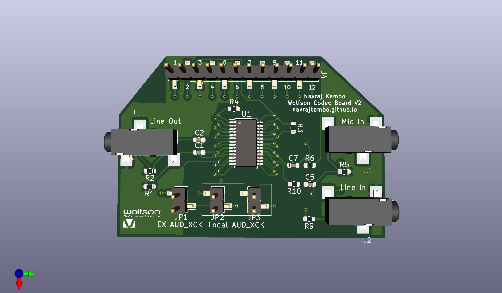
    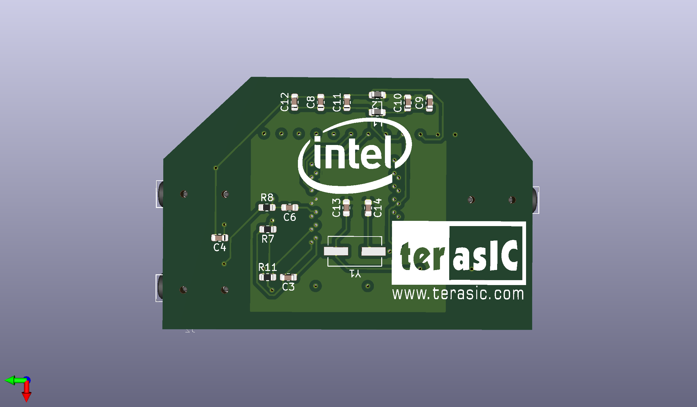

