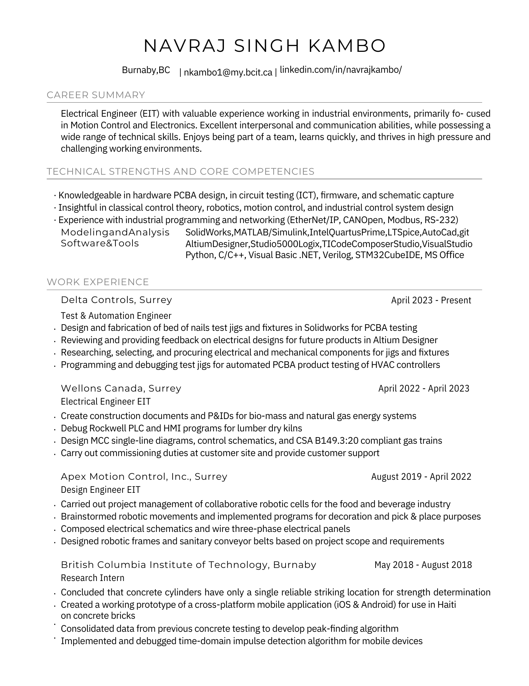
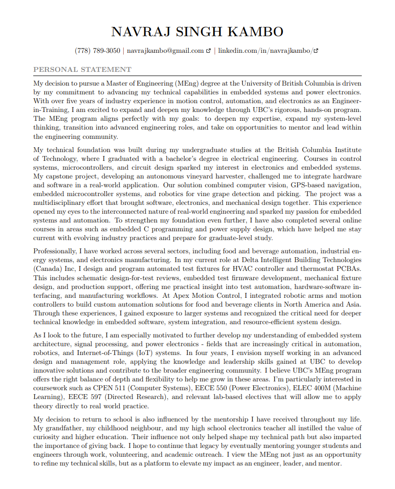
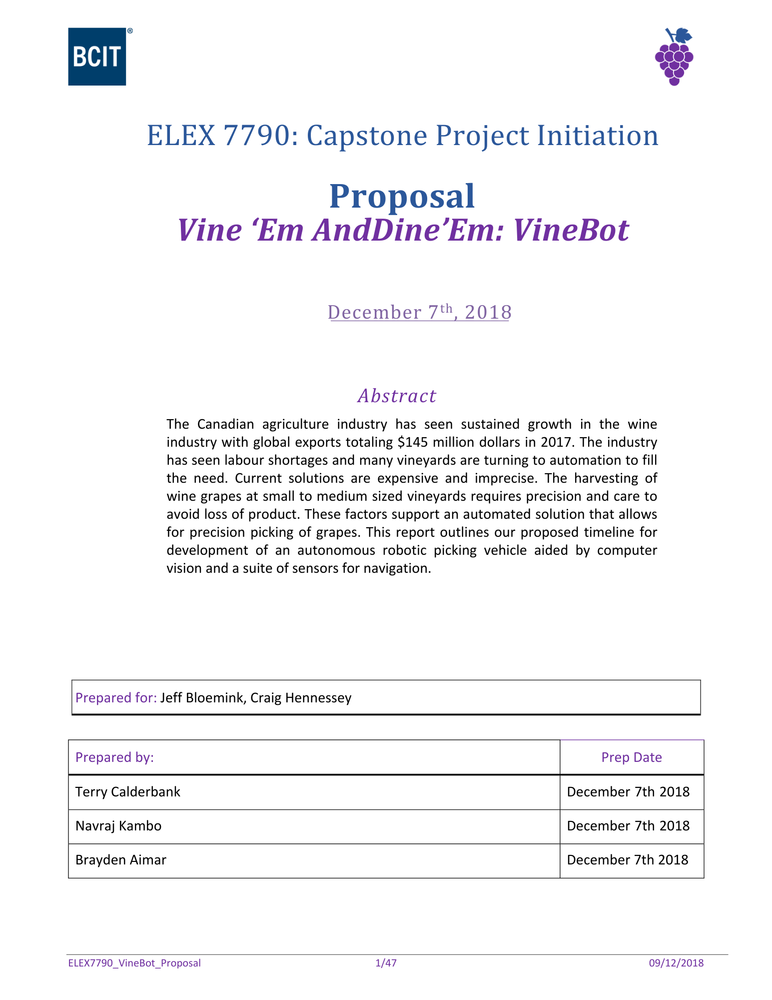
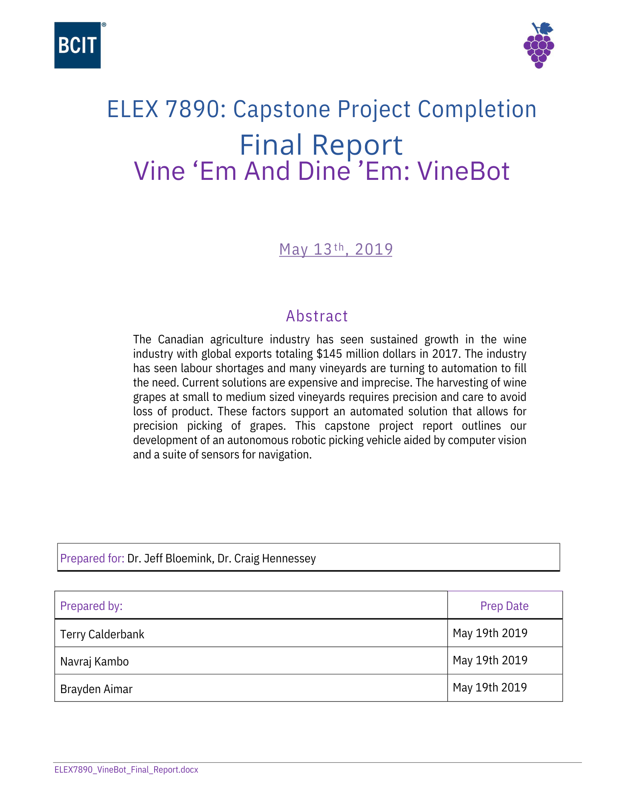

# Resources

Useful cheatsheets and reference materials.

    <a href="assets/downloads/NK-Presentation-Generic-Portfolio.pdf" class="resource-card" target="_blank">
        

            
        

        
My Generic Portfolio

    </a>
    <a href="assets/downloads/Navraj_K_Generic_Resume.pdf" class="resource-card" download>
        

            
        

        
My Generic Resume

    </a>
    <a href="assets/downloads/Navraj_S_PS_Gradschool.pdf" class="resource-card" download>
        

            
        

        
My Grad School Personal Statement

    </a>
    <a href="assets/downloads/ELEX7790_VineBot_Proposal_rr.pdf" class="resource-card" target="_blank">
        

            
        

        
ELEX7790 Capstone VineBot Proposal

    </a>
    <a href="assets/downloads/ELEX7890_VineBot_Final_Report_rr.pdf" class="resource-card" target="_blank">
        

            
        

        
ELEX7890 Capstone VineBot Final Report

    </a>
    <a href="assets/downloads/Certificate of Training_Navraj Kambo.pdf" class="resource-card" download>
        

            <svg viewBox="0 0 24 24" fill="none" stroke="currentColor" stroke-width="1.5" stroke-linecap="round" stroke-linejoin="round">
                <path d="M14 2H6a2 2 0 0 0-2 2v16a2 2 0 0 0 2 2h12a2 2 0 0 0 2-2V8z"></path>
                <polyline points="14 2 14 8 20 8"></polyline>
                <line x1="16" y1="13" x2="8" y2="13"></line>
                <line x1="16" y1="17" x2="8" y2="17"></line>
                <polyline points="10 9 9 9 8 9"></polyline>
            </svg>
        

        
SFU MECH420 Cert

    </a>

